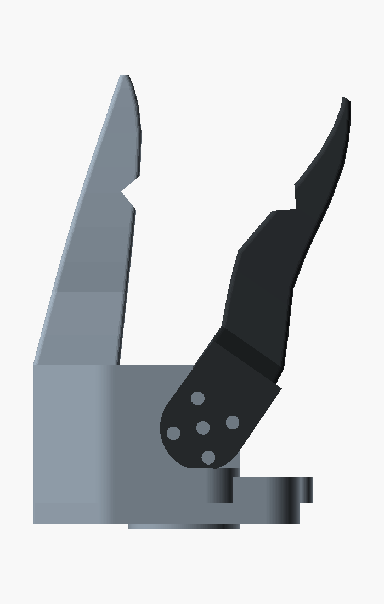
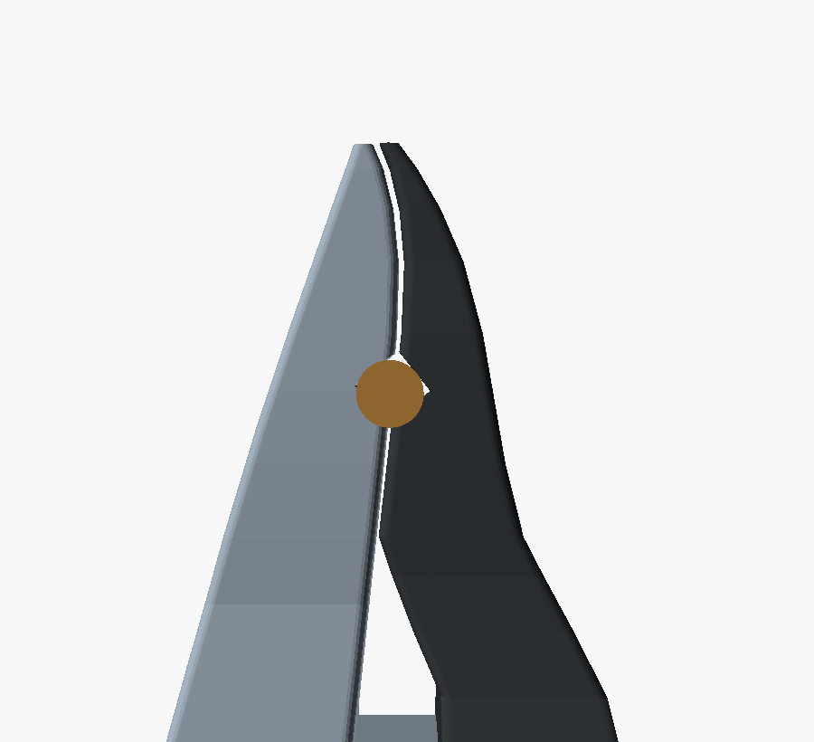

# Crow beak — a New Caledonian crow's bill as an SO-101 end effector

A drop-in replacement for the SO-101's stepped jaws, shaped after the bill of
the **New Caledonian crow** (*Corvus moneduloides*) — the tool-using crow that
gets called the most dexterous beak there is.



**Nothing that touches the arm moved.** The wrist_roll horn pocket, the gripper
servo cradle, the cable bore, the fork, the horn bolt pattern and the jaw pivot
are all the SO-101's own geometry, included straight out of `../params.scad`
and `../fixed_jaw.scad` / `../moving_jaw.scad`. Only the two blades are new, so
the servo, the horn, the bus wiring and the `gripper.pos` channel are unchanged.
The calibration is not: new jaws mean new travel limits (see *Before you print*).

```bash
./build.sh                                        # STLs + PNGs + the interference test
openscad crow_beak.scad                           # or just open it
openscad -D 'crow_opening=25' crow_beak.scad      # 25 mm of gape at the tip
openscad -D 'part="tool"'     crow_beak.scad      # with a Ø6 rod chucked
```

| file | what it is |
|---|---|
| `crow_params.scad` | every dimension of the beak, plus the self-checks |
| `crow_common.scad` | the station lists both mandibles loft from, and the tool notch |
| `crow_upper.scad` | upper mandible on the stock wrist-roll follower body |
| `crow_lower.scad` | lower mandible on the stock gripper-servo fork |
| `crow_beak.scad` | **open this one.** the assembly, with `crow_opening` in mm |
| `check_interference.sh` | sweeps the stroke and proves the mandibles never touch |
| `build.sh` | regenerates every STL and PNG below |
| `render/`, `export/` | build outputs. never hand-edit, just re-run `build.sh` |

**Where this is going:** [`plans/crow_gripper.md`](../../../plans/crow_gripper.md)
is the decision about making this hook-led — load carried by the shape of a
gated throat near the commissure rather than by pinch force at the tip — and why
the throat goes at the *back* of the beak. To iterate this model by voice:

```bash
CADLOOP_TARGET=crow node Scripts/cadloop/cadloop.mjs
```

## What was borrowed from the bird

The NC crow's bill is odd for a corvid in three specific ways, and all three are
mechanically useful:

**1. The culmen is nearly straight.** Most crows are decurved; this one isn't.
A straight upper jaw keeps the contact force pointing down the blade instead of
peeling off the end of it. Here `crow_culmen` is a straight chord from the back
of the servo cradle to the tip with about 1 mm of convex bulge.

**2. The lower mandible is upturned.** Straight upper plus upturned lower means
the two tips converge nose-up and meet as forceps rather than shears. The shared
`crow_tomium` line runs straight at 5.9° for 46 mm and then swings 28° back
toward the upper jaw over the last 21 mm. The lower mandible also carries a
gonydeal angle at z = 84, where the flat keel kicks up to the tip.

**3. Deep base, strongly compressed side-to-side.** 20 mm of upper mandible at
the root tapering to 2.2 mm at the tip, and 29.6 mm wide at the root tapering to
3.4 mm. Deep base = a short stiff load path from the tip. Compressed = the tip
gets into a gap.

Two things follow from beak anatomy that the stock jaws don't do:

- **The beak closes along its whole length, not at the tip.** Both mandibles are
  built to one shared tomial curve, so at `crow_opening = 0` they meet as a
  43 mm line rather than as a pair of pads with a throat behind them. On paper —
  the target task in `plans/hand_1_0.md` §2 — that is the difference between a
  pinch and a crease. The tomia are flat lands, not knife edges: 18.8 mm wide
  where they meet at the commissure, 3.4 mm at the tip.
- **The mandibles part at a commissure.** The lower one has to swing clear of
  the body, so its tomium leaves the shared line below z = 62 and ramps back to
  the neck, exactly the way a bill opens at the gape.

## The tool notch



NC crows hold a stick in the bill and keep hold of it while probing. A 90° V cut
into both tomia at z = 78 does the same job: a rod seats on four line contacts
instead of skidding on two flat faces, and the clamping force is normal to the V,
which is the only direction these jaws can push. (A bore down the beak axis would
look better and be useless — these jaws cannot squeeze along Z.)

`crow_opening_for_rod(d)` gives the gape that seats a rod of diameter `d`, in the
same millimetres-at-the-tip `crow_opening` uses:

| rod | gape at the tip |
|---|---|
| Ø5.66 and under | 0 — held with the beak shut |
| Ø6 | 0.72 mm |
| Ø10 | 9.08 mm |

## Self-checks

`../NOTES.md` §5 says the one thing this model was missing is an interference
test. It's here, and in two forms.

**A closed-form one, in `crow_params.scad`.** The moving jaw turns about a pivot,
so every point on it can only move along its own circle about that pivot. If the
radius from the pivot grows strictly along the tomial line, the rotated lower
tomium is everywhere inside the fixed one and the two cannot touch except at
`crow_opening = 0`. That is asserted on every compile, for both mandibles, so a
bad row in `crow_tomium` stops the render instead of producing jaws that jam.
Alongside it: the lower mandible must not cut through the upper at closed, the
tip must stay above `crow_tip_min_t`, the notch must fit inside the material it
is cut into, and the width must narrow monotonically.

**An empirical one, `check_interference.sh`.** Actually intersects the two solids
at ten openings from 0 to 50 mm and reports the overlap volume. Everything above
0.05 mm comes back empty. At exactly 0 you get 0.85 mm³ of coplanar-face film —
the beak is shut and the two tomia are the same surface, which is the point.

```
  opening 0      0.8532 mm^3 of coplanar-face film (the beak is shut)
  opening 0.05   clear
  ...
  opening 50     clear
  interference: clear
```

## Before you print

Honest list of what is drawn rather than measured, and what is still open.

- **The beak shape is drawn, not scanned.** Every number in `crow_params.scad` is
  mine. The brief was "that general shape" and that is what this is: the three
  features above, at the right proportions, not a specimen.
- **`jaw_pivot_x` / `jaw_pivot_z` are inherited, and they are inferred.**
  `../NOTES.md` §6 flags the assembly transform as the one number in the stock
  rebuild that was solved rather than read out of the STEP. These jaws are built
  to it. If it is wrong, both sets of jaws are wrong together.
- **The gripper needs recalibrating.** `lerobot_calibration/follower_right.json`
  has ID 6 at 1594–3018 ticks against the stock jaws. The travel here is
  different (0 to about 35° of pivot), so re-run the homing before driving it.
- **The tip is 2.2 mm thick per mandible.** Fine at three perimeters, but print
  it standing up, along Z, or the blade is a cantilever of layer lines.
  `crow_tip_min_t` is the knob if your printer disagrees.
- **Not tested: whether it actually picks up paper.** The tomia close as a line
  and that is the argument, but nothing here has touched a sheet.
- **Inherited, not introduced: the fork/body overlap below z = 38.** The stock
  rebuild has it too (`../NOTES.md` §6, item 5) — `fj_fork_clearance()` is a
  square step where the real part has a swept arc. `check_interference.sh`
  clips it away so the test means "the mandibles never touch"; fixing it is a
  job on the stock body, not on the jaws.
