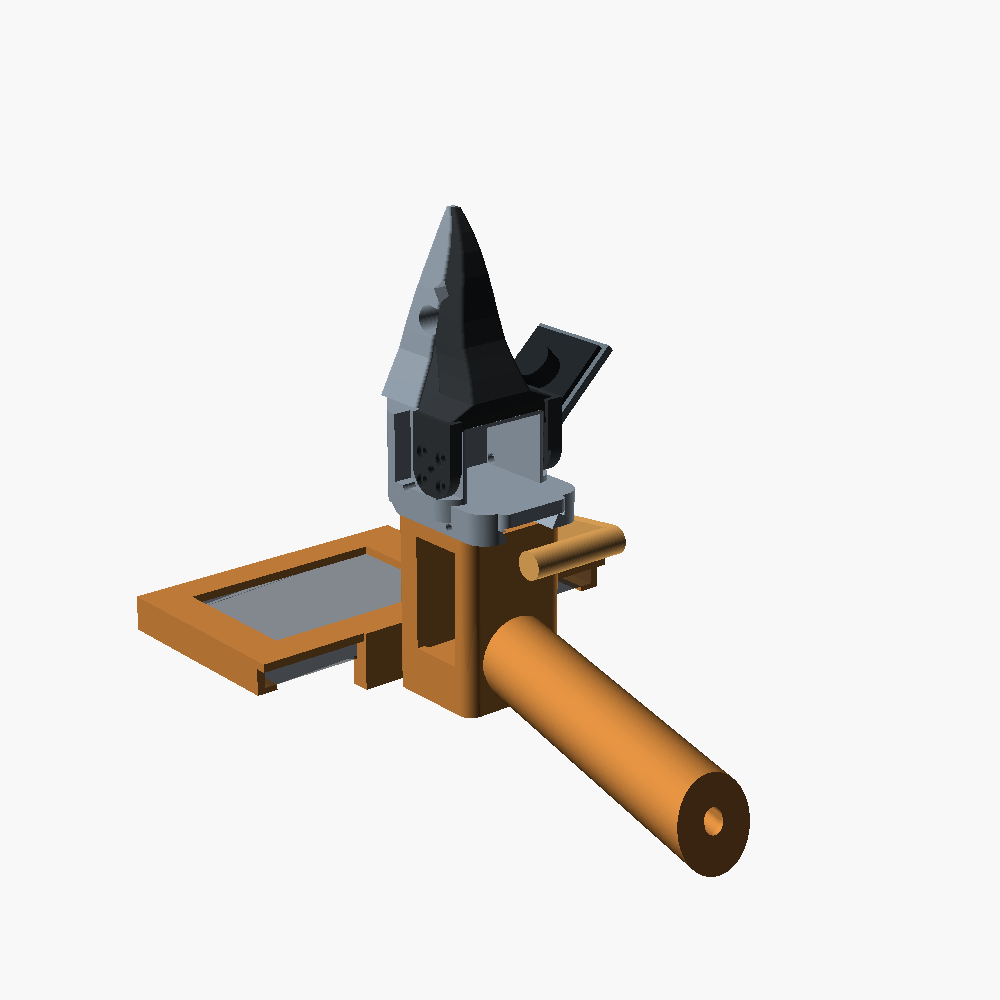
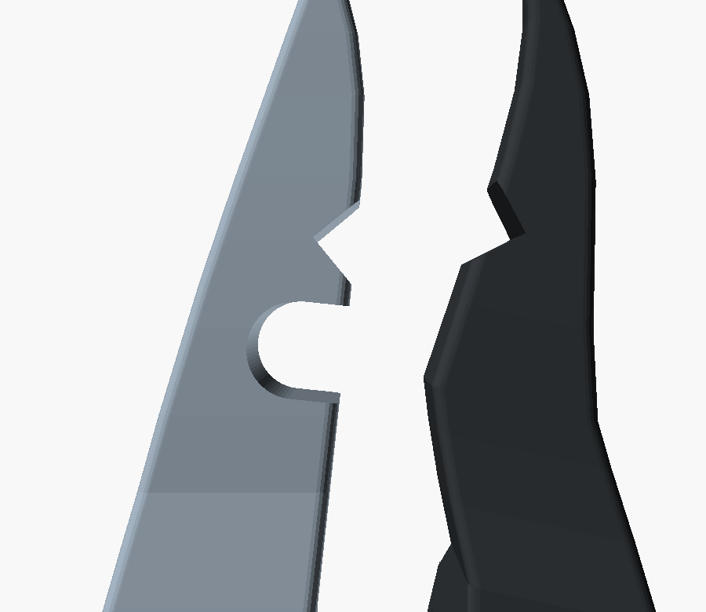

# The crow gripper — hook-led, and what that costs at the wrist

Status: **DESIGN + CAD, nothing printed (2026-09-30, voice-805d4970).** §1–8 are
the first pass: what hook-led costs at the wrist, and the decision to put the
hook at the back of the beak. §9–12 are the second pass, after Jake made
human-held demonstration a core requirement: **one crow cartridge that docks
on the SO-101 wrist or on a handle**, the throat cut, the capture plan, and a
test ladder that keeps "the geometry works" apart from "it grasps" and from
"the data transfers". Nothing in this document has touched hardware.

Reading order: [`gripper_bet.md`](gripper_bet.md) for why the end effector is
the argument at all, [`molmoact2.md`](molmoact2.md) for the north star,
[`../cad/openscad/crow/README.md`](../cad/openscad/crow/README.md) for the beak
that already exists on the bench model.

---

## 1. First, a correction to the premise — and it changes the design

The brief reasons: *New Caledonian crow → makes and uses hooked tools → so the
end effector should be hook-led.* The middle step is right and the jump is not.

**The New Caledonian crow's bill is not hooked.** It is conspicuously *less*
decurved than other corvids — a nearly straight culmen with an upturned lower
mandible. That straightness is not incidental; it is what lets the bird hold a
stick in line with the force it is applying. The hooks in the story are on the
**tools** the bird manufactures — hooked twigs and barbed pandanus leaves — not
on the animal. The crow's own gripper is a forceps.

So there are two different things the bird licenses, and they are not the same
project:

| reading | what it means here | verdict |
|---|---|---|
| **hooked beak** — put a claw on the end effector | a passive shape that carries load without squeezing | keep the *principle*, reject the literal claw — §5 |
| **hooked tool** — the gripper's job is to hold a hook | a chuck, so the tool is the end effector and it's swappable | already half-built (`crow_opening_for_rod`), and the better long game |

The honest version of "hook-led" is therefore **load carried by shape rather
than by pinch force**, which is a mechanical property, not a silhouette. That is
what the rest of this document decides against, and it turns out the strongest
argument for it has nothing to do with the bird — see §5.

## 2. What the SO-101 wrist actually offers

Everything below is measured geometry in the repo, not recollection. Sources:
`cad/openscad/params.scad` (tagged `[STEP]`/`[DERIVED]`/`[GUESS]`),
`cad/openscad/NOTES.md` §6, `lerobot_calibration/follower_right.json`.

**The mount is one flange and it is not negotiable.** The end effector bolts to
the `wrist_roll` servo horn: a Ø24 × 6 mm recess, Ø5.4 centre, four Ø3.2
clearance holes on a 9.9 mm square inside a Ø14 bolt circle, with Ø6 × 6
counterbores. That pattern, the servo cradle it sits above, the cable bore and
the fork are the entire arm interface. Everything above `fj_body_top_z = 38.0`
is ours to redraw; everything below it is the arm's.

**There is exactly one actuator and one channel.** The gripper is bus servo
**ID 6**, commanded as one number, `gripper.pos`, alongside the other five
joints — calibrated today at **1594–3018 ticks** against the stock jaws. There is
no second channel to add without adding a servo to the bus, and no force or
tactile feedback anywhere in the loop.

**The lever arms, from the pivot at (x 4.4, z 23.375):**

| contact point | height z | radius from pivot | force vs. the tip |
|---|---|---|---|
| fingertip | 105.375 | **83.78 mm** | 1.00× |
| tool notch | 78.0 | **56.69 mm** | 1.48× |
| commissure | 62.0 | **42.1 mm** | 1.99× |

(`crow_tip_arm` and `crow_notch_r` are echoed by the model on every compile; the
commissure figure is `hypot(-12.4 - 4.4, 62 - 23.375)`.)

**The consequence that settles the brief's "fewer actuated parts":** there are
none to remove. The SO-101 gripper is *already* one actuator and one degree of
freedom. The only number below one is zero, and §5 disqualifies zero. **So the
hook cannot pay for itself in part count — it has to pay in force and in
holding, or it does not pay.**

## 3. Payload — what the swap actually costs

The arm is quoted in [`voice-3c221288`](../pebbles/queue/voice-3c221288) at
**~413 mm reach and 0.5 kg payload**. That number is inherited from that plan
and has not been measured here; treat it as the working budget, not as a fact.

**Mass, measured.** A volume integral over the committed STL exports, solid
volume × 1.24 g/cm³ for PLA, and again at a realistic 40 % infill:

| part | volume | solid PLA | @40 % |
|---|---|---|---|
| stock fixed jaw (body + jaw) | 66.36 cm³ | 82.3 g | 37.0 g |
| stock moving jaw | 21.74 cm³ | 27.0 g | 12.1 g |
| **stock pair** | **88.10 cm³** | **109.3 g** | **49.1 g** |
| crow upper mandible (same body) | 66.04 cm³ | 81.9 g | 36.9 g |
| crow lower mandible | 21.02 cm³ | 26.1 g | 11.7 g |
| **crow pair** | **87.05 cm³** | **107.9 g** | **48.6 g** |

**The beak swap is payload-neutral: 1.2 % lighter, and the tip is at z = 105.375
in both, so the mass moment about the wrist is unchanged.** That is the baseline
any hook has to beat or match.

**The lever matters more than the mass.** 0.5 kg at the fingertip is 4.9 N acting
105.4 mm past the wrist_roll flange — 0.52 N·m of wrist pitch, against an
end-effector that weighs a tenth of that load. So the design question for payload
is not "how heavy is the hook" but **"how far out does the load hang"**:

- Load held in a throat at the **tool notch (z 78)** sits **27.4 mm closer** to
  the wrist than a fingertip pinch — a **26 % cut** in the end effector's share
  of the wrist moment.
- At the **commissure (z 62)**, 43.4 mm closer — **41 %**.
- Conversely, every 10 mm a claw adds past z = 105.375 adds ~9.5 % to that share,
  and ~2.4 % to the whole-arm moment at full extension.

**And grip force is free at the same place.** Same servo torque, 1.48× the normal
force at the notch and 1.99× at the commissure (§2). A hook that holds near the
root is both stronger and cheaper on payload, which is a rare direction where
the two constraints agree. **That agreement is the whole design, and it says the
hook goes at the back of the beak, not on the front of it.**

## 4. The grip force the stock arrangement can't give you

`hand_1_0.md` §2 already names the honest problem: the SO-101 is a chain of
position-controlled servos with no force sensing at the tip, so commanding a
position against an object gives you whatever force the geometry and the torque
limit happen to produce. It is not a controlled quantity.

A friction pinch needs it to be. Holding mass *m* on two faces takes normal force
N ≥ mg / 2μ — for 0.5 kg on printed PLA at μ ≈ 0.4, about 6 N, *sustained*, for
as long as the object is held, with a stalled servo and nothing measuring it.

A hook needs none of it. The load sits in a throat and is reacted by the throat's
walls; the actuator only has to keep the gate shut, and a gate that closes past
the load's escape line holds it at essentially zero holding torque. **That is the
real content of "grip by shape and leverage instead of pinch force", and it is a
direct answer to the one thing `hand_1_0.md` calls the least certain part of the
design.**

## 5. The north-star test: what a VLA can actually drive

From [`molmoact2.md`](molmoact2.md): the SO100/101 checkpoint observes **two RGB
streams plus joint positions and nothing else — no force, no tactile** — scores
**56.7 %** zero-shot out of distribution, and the paper calls zero-shot brittle.
Two things follow, and they point opposite ways.

**For the hook.** A model that cannot sense force cannot regulate it. Every gram
of holding that comes from geometry instead of from a commanded squeeze is
holding the policy does not have to close a loop on. On this observation space, a
shape-based grip is *strictly* easier to drive than a friction pinch. This is a
better argument for hook-led than the bird is.

**Against a passive hook.** A 0-DoF hook has no "close". The gripper channel the
policy emits would control nothing, and getting a load into and out of a passive
hook needs a specific approach-hook-lift-and-tilt trajectory. **That is precisely
the "bespoke scripted motion" the brief rules out.** Dropping to zero actuators
does not simplify the robot; it moves the mechanism into the policy, where it is
harder and where we have no way to train it.

**The residual risk, stated plainly:** the checkpoint's community training data
was recorded with the stock stepped jaws in frame. Any reshaped end effector is
an embodiment shift in the wrist camera's view, and we cannot know what it costs
zero-shot until there is a camera and a number. That is not an argument for never
changing the jaws; it is an argument for §6's D7.

## 6. The decision

**D1 — the arm interface does not move.** The horn pocket, bolt pattern, servo
cradle, cable bore, fork and jaw pivot stay exactly as `params.scad` has them,
as the existing beak already does. Changing them invalidates
`lerobot_calibration/` and buys nothing this design needs.

**D2 — one actuator stays, and so do open/close semantics.** Rejecting the 0-DoF
passive hook, on §5. `gripper.pos` keeps meaning "how open", so any policy that
can drive the stock gripper can drive this one. What changes is the actuator's
*job*: from "squeeze hard enough to hold" to "shut the gate".

**D3 — the hook is a gated throat, not a claw.** The hook feature is a closed
loop formed *between* the two mandibles when they shut — the upturned lower
mandible and the upper one bounding a pocket — rather than a barb hanging off one
jaw. A claw catches on things when it is open, which is a liability on an arm
driven by a brittle policy; a throat is inert until the gate closes.

**D4 — the throat goes at z ≈ 62–78, not at the tip.** §3: 1.48–1.99× the normal
force and 26–41 % less wrist moment, at the same servo torque and the same mass.
Both constraints point the same way and this is the only place they do.

**D5 — the tip stays at z = 105.375 and stays a working forceps.** The hook is a
*second grip mode at the root*, not a replacement for the tomial line. The tip is
what reaches into a gap and what has any chance on paper (`hand_1_0.md` §2), and
keeping the reach identical is what keeps §3's mass moment neutral and the
workspace unchanged.

**D6 — the existing V notch is the hooked-*tool* half of §1, and it stays.**
`crow_opening_for_rod()` already chucks a Ø6 rod with the beak essentially shut.
The throat sits beside it on the same tomial line, and the long game — the crow's
actual trick — is that the end effector holds a hook rather than being one.

**D7 — nothing gets printed until there is a wrist camera and a stock-jaw
baseline.** `molmoact2.md`'s cheapest-test-first applies here unchanged: the beak
and the hook are both bets against a stock jaw whose success rate on a real task
we have never measured. Printing first means paying for a shape we cannot score.

**What was rejected:** a passive 0-DoF hook (§5), a second servo for a
thumb/latch (fails "as little as possible" for a capability we haven't shown we
need), a claw past the fingertip (§3 payload, §6 D3 snag risk), and any change to
the wrist mount (D1).

## 7. What this does not settle

- **The 0.5 kg / 413 mm figures are inherited, not measured here.** Every
  percentage in §3 is a ratio and survives a correction to the absolute number,
  but the absolute headroom does not.
- **`jaw_pivot_x` / `jaw_pivot_z` are the one inferred pair in the whole model**
  (`NOTES.md` §6). Every lever arm in §2 is built on them. If they are wrong,
  both jaw sets and this entire analysis are wrong together, and calipers settle
  it.
- **No throat geometry exists yet**, so no interference proof exists for it
  either. The closed-form check in `crow_params.scad` assumes radius-from-pivot
  climbs monotonically along the tomium; a throat is a local *dip* in that radius
  and will trip the assert. Extending the proof to a piecewise-monotonic tomium
  is a prerequisite, not a detail.
- **Friction coefficient, spring rate and the real servo torque at ID 6 are all
  guesses.** §4's 6 N is an order-of-magnitude argument, not a spec.
- **Nothing here has touched hardware.** No print, no sheet of paper, no load.

## 8. Next step, and the loop it runs in

`Scripts/cadloop` is the loop for this, as the brief says — and it could not see
the crow model at all: it was hardwired to `cad/openscad/params.scad` and
`gripper.scad`. It now takes a target, so the beak can be iterated by voice on
its own parameters:

```bash
CADLOOP_TARGET=crow node Scripts/cadloop/cadloop.mjs
# "pebbles, design, open the beak 10 millimetres"
```

Only `crow_params.scad`'s own numbers are offered to the edit engine, and it
declares none of the mount dimensions — it `include`s the stock `params.scad` for
those. So **D1's freeze is enforced by the file layout**, not by care: the horn
pocket, the cradle and the pivot are unreachable from the loop by construction.

Wiring it up turned up a real bug in the loop, worth knowing about. `params.mjs`
scored a parameter "live" only if a geometry file named it directly. On the stock
gripper every station table is named directly by `moving_jaw.scad`, so this never
showed. On the beak, `crow_tomium`, `crow_culmen` and `crow_gonys` — the three
lists that *are* the beak's shape — are read only through `crow_tomium_x()` and
its siblings inside `crow_params.scad`, so they scored "indirect" and were never
offered to the edit engine. The loop would have rendered the beak and then
quietly refused to reshape it. Liveness now follows the params file's own
functions transitively. The stock model's seven refused dead names are unchanged
by that, which is the invariant that mattered.

The throat would add roughly five parameters, all to `crow_params.scad`:
`crow_throat_z` (where on the tomium), `crow_throat_d` (the bore it holds),
`crow_throat_depth`, `crow_throat_lip` (how far past the escape line the gate
shuts) and `crow_throat_r` (the root radius, which is where it will crack).

**Say the word and I'll cut it in the loop.** The one thing to react to first is
D4 — the hook at the back of the beak rather than the front of it — because
everything else follows from it.


---

# Part 2 — one beak, two hosts (voice-805d4970, 2026-09-30)

The requirement that changes things: the **same** end effector has to be held
by a person collecting demonstrations on everyday objects *and* mounted on the
SO-101, with the contact geometry and the action/state representation kept the
same across the two wherever practical. Handheld collection is core, not an
accessory. `plans/handheld_gripper.md` (voice-b4fbc4ee) already chose the
capture method; this part uses it rather than inventing a second one, and
swaps the crow in where it said "Hand 1.0".

CAD for everything below is in `cad/openscad/crow/` and rebuilds with
`./build.sh`, which also runs the interference sweep and the wrist budget.



## 9. The decision: a cartridge and a dock

**D8 — what moves between hosts is a cartridge, and it is everything that
touches the object or sees it.** Upper mandible + body, the gripper servo
(ID 6), lower mandible, and the wrist camera on its mount. Nothing about the
contact geometry, the actuator, or the camera's view of the beak can differ
between modes, because they are one physical object. Hand 1.0 argued for this
(`hand_1_0.md`, "the identity thesis"); here it is enforced by construction.

**D9 — the cartridge sits on a dovetail dock, and both hosts carry the same
rail.** `crow_dock.scad`: a 60° dovetail along X, open toward +X, one M3
cross-pin to lock it. The **wrist puck** carries the rail and bolts to the
wrist_roll horn with the SO-101's own pattern. The **handle** carries the
rail from the same module. Swapping is: pull the pin, slide off, slide on, pin.

Why D1 had to bend: the stock body bolts to the horn with four screws that sit
*under the gripper servo*. Taking it off the arm means taking the servo out.
The arm interface itself still does not move. The horn pattern, the recess and
the centre bore are all in the puck, untouched. What changed is that the
cartridge no longer bolts straight to the horn. `crow_mount = "horn"` still
builds the original direct-bolt body.

**What the dock costs, measured** (`check_budget.py`, off the STLs):
- The puck adds **9.05 mm** between the horn face and the cartridge, so the tip
  is 114.4 mm out instead of 105.4. On a full 0.5 kg tip load that is
  +0.044 N·m, **8.6 %**.
- Arm-side mass is **140 g** with the camera, against 104 g for the stock
  gripper without one (printed at ~40 % infill; servo and camera masses are
  *guesses*). That is under the 250 g the handheld plan budgets, which is
  itself unverified.
- The throat undoes it: 0.5 kg held in the throat is 76.5 mm out instead of
  114.4, which is **33 % less** wrist moment than the same load at the tip.

**D10 — `gripper.pos` is always read from ID 6, in both modes.** In the hand,
the trigger is a second, back-driven STS3215 read as a *leader*. The
cartridge's ID 6 follows it, exactly as the follower follows the leader arm in
teleop. So:
- the recorded gripper channel is the **measured position of the same servo on
  the same jaw**, in both modes. No trigger-to-jaw mapping appears in the
  data, only in the live control loop, where a mapping can be wrong without
  corrupting anything recorded;
- grip force is capped by **ID 6's own torque limit** in both modes, so a
  human cannot demonstrate a squeeze the robot cannot produce;
- the calibration travels with the cartridge. The homing offset lives in the
  servo *(LeRobot writes it to the motor; check this on the bench)*.

The trigger has 28° of travel over a ~39 mm lever (about 19 mm at the pad),
mapped linearly onto ID 6's calibrated range. It is a leader, not a lever, so
the ratio is free. The cost to state plainly: **the human gets no feel from
the jaw.** The grip is by-wire. The leader servo can be torque-enabled softly
as a return spring, and later it could push back in proportion to ID 6's
present load. That is not built.

**D11 — the camera sits where a crow's eye is.** NC crows have unusually wide
binocular overlap, and their straight bill keeps the tip inside the visual
field while they work a tool (Troscianko et al. 2012, *Nature
Communications*). The camera goes lateral on the cartridge (`cam_pos`,
y = 36 mm), toed in 43° to aim at the tomial line. It is outside
|y| = 24, so the lower mandible's fork can never sweep it. The model checks
the framing on every compile (`crow_params.scad` check 7): the tip is 13.3° off
axis, the throat 13.5°, and the fully open tip 35.8°, against 55° available
at a 110° lens. In the hand the camera looks forward and away from the grip,
so the human arm stays mostly out of frame. `handheld_gripper.md` §2 names
that as the main visual gap. It has to be measured, not assumed.

**D12 — the phone rides on the handle only.** Landscape, screen to the user,
rear camera forward past the beak, on the culmen side (up, in the bird
posture). ARKit gives `T_world←phone`. The CAD gives `T_phone←dock` (§11
checks it). The arm never carries it.

## 10. The hook: the throat, cut



D3/D4 said: a gated throat between the mandibles at z 62–78. It exists now
(`crow_throat()`, parameters `crow_throat_*`):

- A **U pocket cut into the upper mandible only**, Ø9 at z = 67.5 and 9 mm
  deep, opening onto the tomial line. It is sized for mug handles, bag straps,
  cables and drawer pulls (~6–10 mm; the Ø9 is a *guess*, and a parameter).
- **The gate is the lower mandible's own tomium, unchanged.** Shut, it runs
  straight across the mouth and the bar is enclosed. Loads toward the culmen
  and along the beak go into the upper mandible's walls. **Only a load straight
  out of the mouth reaches the servo.** That is "shut the gate" instead of
  "squeeze".
- It opens with **17.8 mm of gape** at the tip (`crow_opening_for_throat`),
  and holds with **1.78× the tip's force** from the same torque.

**The §7 blocker went away rather than being solved.** §7 said a throat is a
dip in the tomium and would break the closed-form interference proof. Cutting
the pocket *behind* the tomial line instead of into it removes material from
the fixed jaw only. The lower mandible is untouched, the proof holds unchanged,
and the sweep still comes back clear at every opening from 0.05 to 50 mm.

New self-checks: the mouth must sit above the commissure, so the gate actually
closes it. There must be ≥1.5 mm of web to the tool notch, ≥3 mm of wall behind
the U, and the pocket must be at least a half-circle deep, or it is a notch
and not a hook.

**Grip modes on one channel.** Tip forceps for small things and paper (D5),
the V notch for rods and tools (D6), and the throat for handles and straps.
The policy never selects a mode. It chooses where the object sits in the beak,
as a crow does, and then closes.

## 11. Capture plan — `handheld_gripper.md` §4, with the crow in it

Unchanged from voice-b4fbc4ee, and deliberately so: the iPhone ARKit tracker,
`lerobot-record` on the laptop, retargeting through LeRobot `RobotKinematics`
into SO-101 joint space, LeRobot v3 episodes with the same schema as teleop,
the automated QC, and the 30/15+15/30/15+45 experiment. What the crow changes:

**The frame both modes agree on is the dock.** Each host supplies its own
transform to the dock, and everything past it is shared:

```
arm:   T_base←dock  = FK(q1..q5) · T_wristroll←dock   (puck: CAD, 9.05 mm)
hand:  T_base←dock  = T_base←world · T_world←phone(ARKit) · T_phone←dock (handle: CAD)
both:  T_dock←tcp, T_dock←camera                     (the cartridge: identical)
```

Retargeting solves IK for **`T_base←dock`**. The tip, the throat and the
camera then come along for free, because they are one rigid part in both
modes.

**Actuation:** `gripper.pos` = ID 6's present position (D10), 30 Hz, the same
channel name and units as teleop. The trigger's position is logged too, as a
diagnostic, but it is never the action.

**Registration and sync** reuse the ArUco board from b4fbc4ee, with one
addition that is only possible because the camera is on the cartridge. At
the start of each episode, **tap the beak tip on a marked point of the
board.** That one gesture gives:
- **sync**: the phone's accelerometer spike, ID 6's `present_load` spike and
  the wrist-camera frame of contact line up in time. That gives one offset per
  episode, with the residual checked against ≤ 1 frame;
- **registration**: the wrist camera solves its own pose from the board
  (PnP), which is `T_base←dock` directly through `T_dock←camera`;
- **a check on the CAD**: the same pose predicted by ARKit · `T_phone←dock` must
  agree with the PnP pose. The disagreement is logged per episode. If it drifts
  across a session, the phone has moved in its cradle, or the CAD transform is
  wrong.

It replaces b4fbc4ee's QR-code flash, which needs the wrist camera to see the
phone screen. On this handle, it can't.

**Added QC** (on top of b4fbc4ee's tracking / IK / sync / range / replay checks):
- tap-registration residual ≤ 5 mm and ≤ 3°, **measured and reported**. This
  threshold is a starting guess;
- `gripper.pos` never exceeds ID 6's calibrated range, and in-throat grasps
  close past `crow_opening_for_throat`;
- the out-of-reach fraction per episode. The operator stands at the robot's
  table with its reach marked on the board. A live out-of-reach tone from the
  phone (FeasibleCap-style) is a follow-up, not built.

## 12. Tests — geometry, grasping and data, kept apart

Each level has to pass before the next one means anything. **Only G0 has been
run.** Everything from G1 on is a plan. No claim of reliable transfer is made
until G5 has a number.

| level | what it shows | how | pass | status |
|---|---|---|---|---|
| **G0 geometric concept** | the parts are self-consistent | `./build.sh`: compile asserts (1)–(7), interference sweep, `check_budget.py` | all asserts hold; overlap clear 0.05–50 mm; ≤ 250 g arm-side | **passing** |
| G1 fit | the printed parts assemble and dock | print cartridge + puck + handle; calipers on `jaw_pivot_x/z` (§7); dock both hosts 20× each | repeatability ≤ 0.2 mm at the tip across re-docks (dial gauge); pin never needs tools | not started |
| G2 mechanism | it holds what it claims, on the bench | ID 6 at its working torque limit; 10 objects each mode: pencil (tip), Ø6 rod (notch), mug by the handle (throat), a sheet of paper (tip) | throat holds a 0.5 kg mug handle with ID 6 **torque off**, shaken; tip/notch hold rate per object | not started |
| G3 handheld capture | the demos are clean | 50 handheld episodes on b4fbc4ee task 1 + one throat task (mug by the handle) | b4fbc4ee QC ≥ 80 % kept; tap residual reported; throughput vs teleop measured | not started |
| G4 embodiment | the arm can do its own demos | open-loop replay of 5 random retargeted episodes on the SO-101 with the same cartridge | ≥ 4/5 | not started |
| G5 transfer | the data helps a policy | b4fbc4ee §4's arms, 20 trials each, **plus the stock-jaw cartridge as a control** (D7) | handheld-heavy beats 30 teleop by ≥ 10 points at equal human time | not started |

G2's torque-off throat test is the one that separates "hook" from "pinch". If
the mug stays on with the servo limp, holding is geometric. If it falls, the
throat is only a pinch with a picture of a hook on it.

## 13. What this part does not settle

- **Every bought-part mass, the STS3215 envelope, the camera board size and the
  phone dimensions are guesses** (tagged `[GUESS]` in `crow_params.scad` and
  `check_budget.py`). Weigh them and swap in the real numbers.
- **The grip ergonomics are drawn, not fitted.** Trigger reach is 58 mm, the
  grip is 100 × 32 × 30 mm and raked 15°. Print the handle alone first and
  hold it. The numbers are parameters, and the loop can change them by voice.
- **No stock-jaw cartridge yet.** D7's control needs the stock fixed jaw rebuilt
  on the dock groove. It is the same change `crow_upper` made, applied to
  `fixed_jaw.scad`.
- **The umbilical is not designed.** The dock is mechanical only. The servo bus
  and the camera USB still need a connector at the cartridge, and
  `hand_1_0.md`'s wrist_roll cable wind-up decision is now live, because a
  camera cable runs through it.
- **The handheld software is not written.** That means the ID 6 follower loop in
  the hand, the tap detector, and the ARKit logger. b4fbc4ee's pipeline covers
  the rest.
- **The dovetail's printed fit is untested.** A 0.2 mm clearance per side is a
  normal FDM slide fit, but it may need a shim or a tweak to `dock_clear`.

**Next, in order:** weigh the bought parts. Then print the puck, the handle and
the cartridge upper and run G1. The stock-jaw cartridge can be built in the
same CAD pass.
